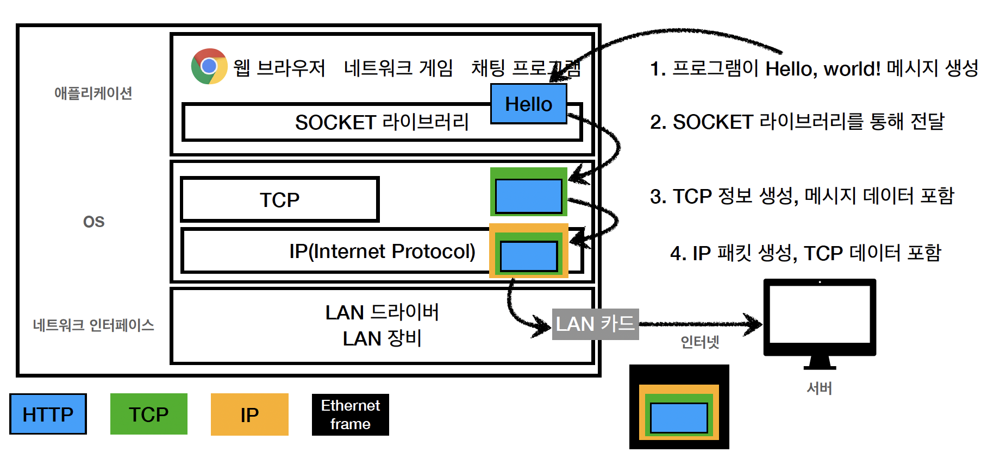

# 1-2. TCP/UDP, PORT

- 인터넷 프로토콜 4계층
  - 애플리케이션 계층(Application Layer) - HTTP, FTP
  - 전송 계층(Transport Layer) - TCP, UDP
  - 인터넷 계층 - IP
  - 네트워크 인터페이스 계층
    
- TCP/IP 패킷
  - IP 패킷 - 출발지 IP, 목적지 IP, 기타…
  - TCP 세그먼트 - 출발지 PORT, 목적지 PORT, 전송 제어, 순서, 검증 정보…
  - 전송 데이터
- TCP(Transmission Control Packet) 특징
  - 연결 지향 - 3 way handshake
  - 데이터 전달 보증
  - 순서 보장
- UDP(User Datagram Protocol) 특징
  - 연결 지향 x, 데이터 전달 보증 x, 순서 보장 x
  - 데이터 전달 및 순서가 보장되지 않지만 단순하고 빠르다
  - IP와 거의 같다고 보면 됨. PORT와 checksum 정도만 추가된 형태
  - 애플리케이션에서 추가 작업이 필요하다
- PORT
  - PORT - 같은 IP 내에서 프로세스 구분
  - 0 ~ 65535 - 할당 가능
  - 0 ~ 1023 - 잘 알려진 포트. 사용하지 않는 것이 좋다
    - FTP - 20, 21
    - TELNET - 23
    - HTTP - 80
    - HTTPS - 443
- DNS(Domain Name System)
  | Domain Name | IP |
  | --------------- | ------------- |
  | abc.example.com | 200.300.249.8 |
  | www.naver.com | 293.484.32.45 |
