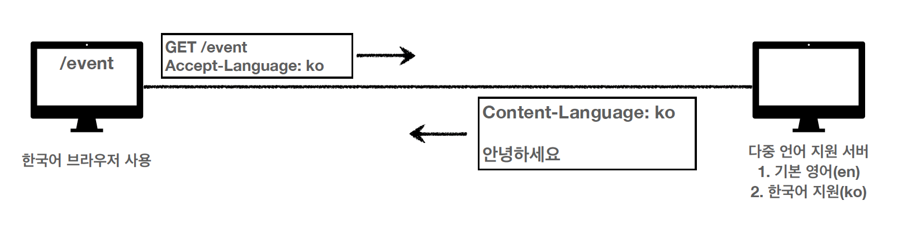
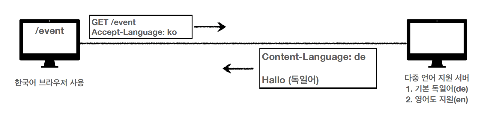

# 1-5. HTTP 헤더

- 용도
  - HTTP 전송에 필요한 모든 부가정보. ex) 메시지 바디의 내용, 메시지 바디의 크기, 압축, 인증, 요청 클라이언트, 서버 정보, 캐시 관리 정보
- 분류
  - RFC2616(과거)
    - General header : 메시지 전체에 적용되는 정보. ex) Connection: close
    - Request header : 요청 정보
    - Response header
    - Entity header
    - message body는 entity body를 전달하는데 사용.
      - entity body는 요청이나 응답에서 전달할 실제 데이터
      - entity header는 entity body의 데이터를 해석할 수 있는 정보 제공 - 데이터 유형, 길이, 압축 정보 등등
  - RFC723x 변화
    - 엔티티 > 표현(representation)
    - representation = representation Metadata + representation data
      > RFC7230(최신)
      - message body를 통해 representation data 전달
      - message body = payload
      - representation → 요청이나 응답에서 전달할 실제 데이터
      - representation header는 representation data를 해석할 수 있는 정보 제공
      - Content-Type, Content-Encoding, Content-Language, Content-Length
        - Content-Type : text/html; charset=utf-8, application/json, image/png
        - Content-Encoding : gzip, deflate, identity
  - 협상(content negotiation)
    > 협상 헤더는 요청시에만 사용
    - Accept : 미디어 타입 전달
    - Accept-charset : 클라이언트가 선호하는 문자 인코딩
    - Accept-Encoding : 클라이언트가 선호하는 압축 인코딩
    - Accept-Language : 클라이언트가 선호하는 자연 언어
      
      
  - 협상과 우선순위
    ```jsx
    GET /event
    Accept-Language: ko-KR, ko;q=0.9, en-US;q=0.8, en;q=0.7
    ```
    - 0~1, 클수록 높은 우선순위
    ```
    GET /event
    Accept: text/*, text/plain, text/plain;format=flowed, */*
    ```
    - 구체적인 것이 우선함
      1. text/plain;format=flowed
      2. text/plain
      3. text/\*
      4. _/_
    ```
    Accept: text/*;q=0.3, text/html;q=0.7, text/html;level=1,
    text/html;level=2;q=0.4, */*;q=0.5
    ```
    - 구체적인 것을 기준으로 미디어 타입을 맞춤
